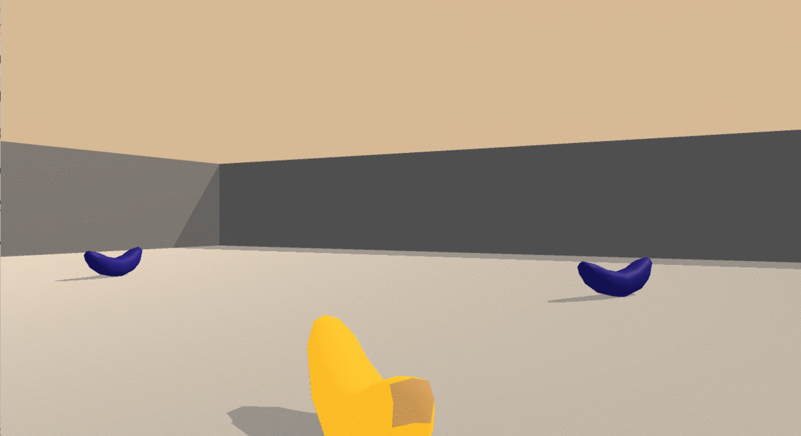

# DEEP REINFORCEMENT LEARNING: Project Navigation.
This repository includes all the needed information to train an agent to collect bananas using similar to UNITY Machine Learning Agents. The latter, works as enviroments to train intelligent agents. This case, yellow bananas from a colletion of blue and yellow bananas.
In this notebook, you will learn how to use the Unity ML-Agents environment for the first project of the [Deep Reinforcement Learning Nanodegree](https://www.udacity.com/course/deep-reinforcement-learning-nanodegree--nd893).

### What is deep reinforcement learning?
DRL is about using deep learning techniques to solve reinforcement learning problems. Deep learning are the techniques that use neural networks to solve classic machine learning problems. The two major concepts of Reinforcement Learning are Agent and enviroments. The former is the machine that makes decisions. The latter is everything related with the decision that have been taken or the why some decision was taken, in other words, is the problem. For more information visit report.pdf.

### More about Unity, DRL and collecting bananas.
Unity provides enviroments that help us train Agents to learn, in this case, how to pick-up bananas. Picking yellow bananas is what we want our agent to perform, therefore we give it a reward (+1) and collecting a blue banana is not something we want, then the reward is negative (-1). The project has 37 states regarding velocity and perception, however, possible actions are **forward, backward, left and right**. We would say it has been done when we get an average score of more than 13 over 100 consectuive episodes.

### How to install everything needed
Create a new **conda** enviroment with Python 3.6. Using `conda create --name drlnd python=3.6; source activate drlnd`.
Also install OpenAI Gym using `pip install gym`. Once you have done that you can automatically use enviroments such as classic control and box2d. You should clone the following repository as follows: `git clone https://github.com/udacity/deep-reinforcement-learning.git; cd deep-reinforcement-learning/python; pip install .`. Finally to create a Jupyter Notebooks Kernel (IPython Kernel) run `python -m ipykernel install --user --name drlnd --display-name "drlnd"` And go inside **p1_navigation** and you will find the navigation notebook. If you will like to train on AWS go to https://github.com/Unity-Technologies/ml-agents/blob/master/docs/Training-on-Amazon-Web-Service.md.
Download your banana folder 
* For linux on: https://s3-us-west-1.amazonaws.com/udacity-drlnd/P1/Banana/Banana_Linux.zip
* For Mac OSX on: https://s3-us-west-1.amazonaws.com/udacity-drlnd/P1/Banana/Banana.app.zip
* For Windows: https://s3-us-west-1.amazonaws.com/udacity-drlnd/P1/Banana/Banana_Windows_x86_64.zip

### How to use the code found here
Make sure your Notebook file is on the same path as you Banana enviroment folder, inside should contain Banana execution files. Also we include dqn.py that includes a class with all the AGENT information, each step and action that is made also a ReplayBuffer class to store experience tuple. This file imports model.py file with Pytorch framework with 3 fully connected layers of input 37 (state size), 64 units first hidden layer and other 64 units hidden layer to a final 4 units output layer (action size). 

